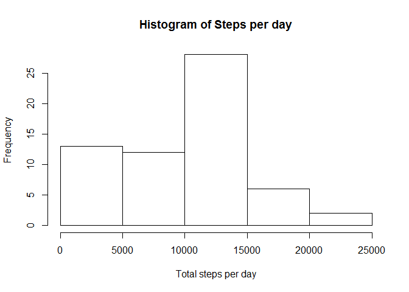
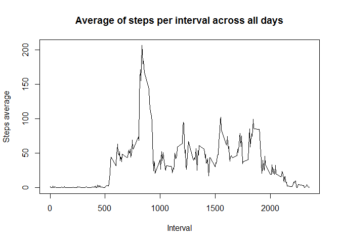
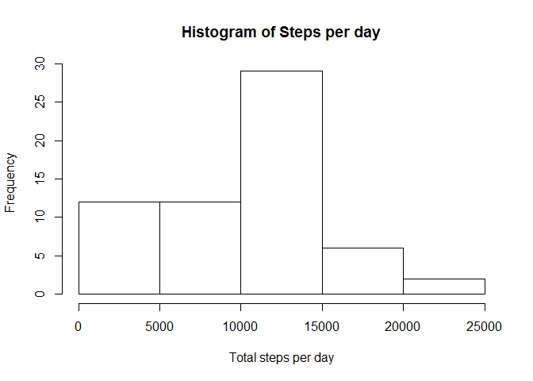
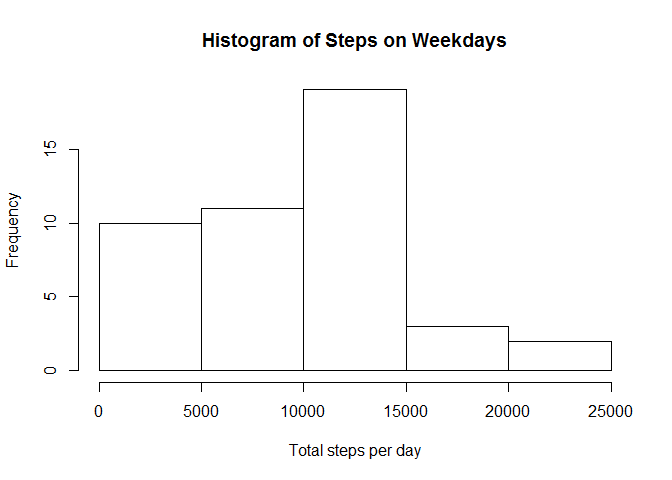
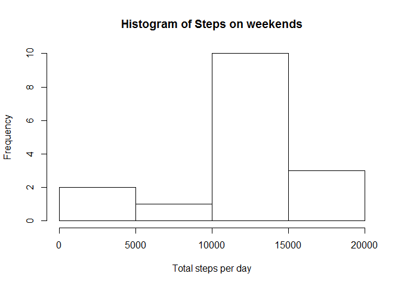

# Reproducible Research: Peer Assessment 1
Bernardo Najlis  
October 11, 2015  


## Loading and preprocessing the data

This code chunk loads the data from the included 'activity.zip' file in the original GitHub forked repo.
To unzip we'll use **utils**.


```r
library(utils)  # to get unzip
unzip("activity.zip")
```

Now we can get the data from the CSV file extracted into a varialbe. Then we'll show just the first couple of rows to get an indea of what's inside the file.


```r
activity <- read.csv("activity.csv")
head(activity)
```

```
##   steps       date interval
## 1    NA 2012-10-01        0
## 2    NA 2012-10-01        5
## 3    NA 2012-10-01       10
## 4    NA 2012-10-01       15
## 5    NA 2012-10-01       20
## 6    NA 2012-10-01       25
```

## What is mean total number of steps taken per day?

First, calculate the total number of steps per day. For this (and some other data wrangling) we'll use **dplyr**.


```r
library(dplyr)
```

```
## 
## Attaching package: 'dplyr'
## 
## The following objects are masked from 'package:stats':
## 
##     filter, lag
## 
## The following objects are masked from 'package:base':
## 
##     intersect, setdiff, setequal, union
```

```r
activity_summary <- activity %>% group_by(date) %>% summarise(total_steps = sum(steps, na.rm = TRUE)) # group by day and sum the steps
head(activity_summary)
```

```
## Source: local data frame [6 x 2]
## 
##         date total_steps
## 1 2012-10-01           0
## 2 2012-10-02         126
## 3 2012-10-03       11352
## 4 2012-10-04       12116
## 5 2012-10-05       13294
## 6 2012-10-06       15420
```

Next, make a histogram of steps taken per day. Included some options to make the chart titles more readable.


```r
library(graphics)
hist(activity_summary$total_steps, main = "Histogram of Steps per day", xlab = "Total steps per day") # Change main title and x axis label
```

 

To calculate the mean and median, we'll use dplyr again.


```r
activity_summary2 <- activity_summary %>% 
  summarise(mean = mean(total_steps, na.rm = TRUE), median = median(total_steps, na.rm = TRUE))
```

The mean is **9354.2295082** and the median is **10395**.

## What is the average daily activity pattern?

First, re-summarize the original data. This time we'll group per interval (across all days) and calculate the average number of steps.
Then, we'll plot this as a *time series*.


```r
activity_summary3 <- activity %>% group_by(interval) %>% summarise(avg_steps = mean(steps, na.rm=TRUE))
plot(x = activity_summary3$interval, y = activity_summary3$avg_steps, 
     type="l", xlab = "Interval", ylab = "Steps average", 
     main="Average of steps per interval across all days")
```

 

Now, using this re-summarized data, we can calculate which interval has the most number of steps across all days.
First, we get the max value, then we find the interval in the re-summarized data set.


```r
activity_max <- activity_summary3 %>% summarise(max =max(avg_steps, na.rm = TRUE))
max_interval <- activity_summary3 %>% filter(activity_summary3$avg_steps == activity_max$max)
```

The max number of average steps across all days is **206.1698113** at interval **835**.

## Imputing missing values

First, calculate how many rows have NA (not available) missing values.


```r
number_of_missing_data <- sum(is.na(activity$steps))
```

There are **2304** rows with NA.

To fill the missing values, we'll replace them with the interval average across days in a new data frame. We will use the values from the previously calculated data frame.


```r
complete <- activity

for (i in 1:nrow(complete)) {
  if (is.na(complete$steps[i])) {
    complete$steps[i] = activity_summary3$avg_steps[i]
  }
}
```

Here is an histogram of the new data frame with complete data. We created another data frame that summarizes steps per day now using the completed data.


```r
complete_activity_summary <- complete %>% group_by(date) %>% summarise(total_steps = sum(steps, na.rm = TRUE)) # group by day and sum the steps
hist(complete_activity_summary$total_steps, main = "Histogram of Steps per day", xlab = "Total steps per day") # Change main title and x axis label
```

 

Now we recalculate mean and median based on this new complete data frame.


```r
complete_activity_summary2 <- complete_activity_summary %>% 
  summarise(mean = mean(total_steps, na.rm = TRUE), median = median(total_steps, na.rm = TRUE))
```

The mean is **9530.7244046** and the median is **1.0439\times 10^{4}**, which are very similar to the ones in the original dataset with NA.

## Are there differences in activity patterns between weekdays and weekends?

We will now create a new factor variable in the dataset with two levels - "weekday" and "weekend" indicating whether a given date is a weekday or weekend day. This will use the complete dataset, and the ***weekdays()*** function.


```r
complete_wdays <- complete %>% mutate(Is.Weekday = 
                                        ifelse(
                                          (weekdays(as.POSIXct(date)) == "Saturday") | (weekdays(as.POSIXct(date)) == "Sunday"), 
                                               FALSE, TRUE))
```

Now let's create two histograms to compare activity on weekdays and weekends. We'll create two new data frames summarizing activity, one for weekdays and one for weekends. 


```r
complete_summary_weekdays <- complete_wdays %>% filter(Is.Weekday == TRUE) %>% group_by(date) %>% summarise(total_steps = sum(steps, na.rm = TRUE)) 

complete_summary_weekends <- complete_wdays %>% filter(Is.Weekday == FALSE) %>% group_by(date) %>% summarise(total_steps = sum(steps, na.rm = TRUE)) 
```


Then, we just plot both histograms

```r
hist(complete_summary_weekdays$total_steps, main = "Histogram of Steps on Weekdays", xlab = "Total steps per day")
```

 

```r
hist(complete_summary_weekends$total_steps, main = "Histogram of Steps on weekends", xlab = "Total steps per day")
```

 

